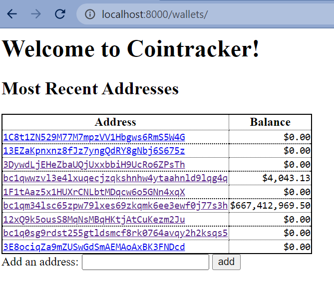
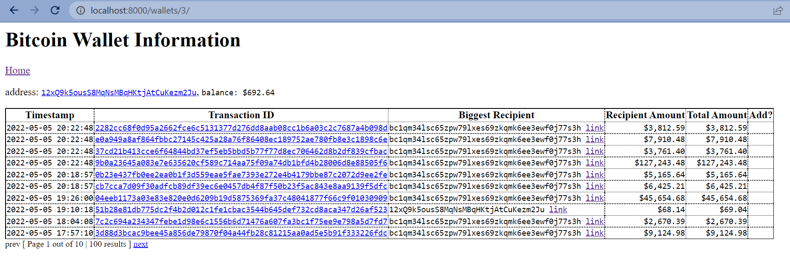

# CoinTracker Clone

It's my attempt at a CoinTracker clone. Everything in it that's clickable should work. The submit buttons to track a wallet, links, POST methods to the DB, and outgoing requests to BlockChain should all be valid.

## Installation Instructions

```powershell
python3 -m venv venv
venv\Scripts\Activate.ps1
python3 -m pip install -r requirements.txt
python3 manage.py migrate
python3 manage.py runserver
```

After setup, you can visit `http://localhost:8000/wallets/`

Some screenshots.

Home Page:



Details Page for a single wallet:



## Assumptions

Originally I thought this was asking to create a ledger for a hypothetical cryptocurrency, and then store it all in a local database. So I ventured out to look into something friendly with Python, but wasn't sure which to choose between Flask and Django. Flask would help keep the codebase simple, but Django would have a lot of nice primitives (i.e. form redirection, out of the box ORM that maps to a Python class).

I didn't realize this should work with real data and then proceeded to look at https://blockchair.com and figure out how to work with the data. I'm not familiar with cryptocurrency either so I spent some time understanding the relationship between addresses and transactions. I was alternating between sending API requests and scraping to figure out how to model the data in Flask for a while before realizing it would be simpler to have a home page and a detail page for a specific wallet in Django and settled with Django in the end. I lost some time alternating between them. Spent time just brainstorming as well, figuring out if it was worthwile doing a single page application with just JavaScript/TypeScript.

Then it came to features. I wasn't sure how much scope to keep, there were a lot of different things to investigate for me between HTML templates, CSS, caching requests so I wouldn't get rate limited from the free tier on BlockChair, make the product look decent at least for a programmer (monospace, tables, Django Template filters for adding commas to big numbers), somewhat keeping it DRY by factoring outgoing API requests, adding nice extra frills like pagination, outgoing links to a more 'authoritative' source like BlockChair in case a user would want to glean more information. It was an interesting open-ended project, lots of opportunities with different angles, and deciding how far I should go in one area between switching to another. I ended up with a very heavy `detail()` method too, I would love to make that leaner and get some code reusage there going on.
